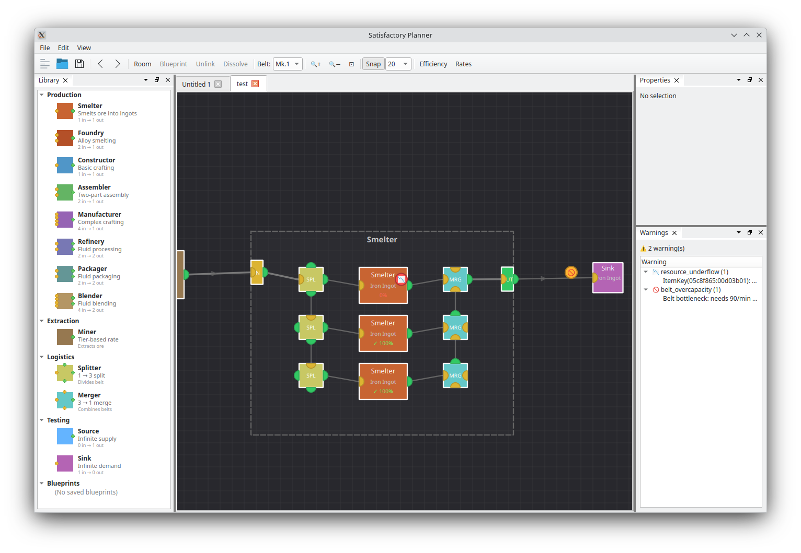

# Satisfactory Planner

A PCB-style factory floor planner for [Satisfactory](https://www.satisfactorygame.com/) with visual building placement, belt routing, and production flow simulation.




## AI Notice

Written almost entirely by Claude Opus 4.5. Impressive work, Opus!

## Features

- **Visual Factory Designer** — Drag-and-drop placement of buildings (Smelters, Assemblers, Miners, etc.) with automatic Dubins-curve belt routing
- **Production Simulation** — LP-based flow solver computes steady-state material flow rates through your factory
- **Real-time Warnings** — Detects bottlenecks, overcapacity belts, underflow conditions, and missing recipes with causal chain explanations
- **Blueprint System** — Save and reuse room layouts as linked instances (edit once, updates everywhere)
- **Multi-Document Tabs** — Work on multiple factory designs with independent undo/redo stacks
- **Efficiency Visualization** — Color-coded overlays showing building duty cycles and belt utilization
- **Customizable UI** — Docking panels (Library, Properties, Warnings) with save/restore layouts

## Installation

### From Source

```bash
# Clone the repository
git clone https://github.com/FeepingCreature/sfplanner.git
cd sfplanner

# Install in development mode
pip install -e ".[dev]"

# Run the application
satisfactory-planner
```

### Pre-built Binaries

Download the latest release for your platform from the [Releases](https://github.com/FeepingCreature/sfplanner/releases) page:

- **Windows**: `satisfactory-planner-windows.exe`
- **Linux**: `satisfactory-planner-linux.bin`
- **macOS**: `satisfactory-planner-macos.app`

## Quick Start

1. **Place buildings** — Drag from the Library panel onto the canvas
2. **Connect with belts** — Click an output port, drag to an input port
3. **Set recipes** — Select a building, choose recipe from Properties panel
4. **Create blueprints** — Draw a room (toolbar button), save to library for reuse
5. **Analyze flow** — Toggle "Efficiency" or "Rates" in View menu to see production analysis
6. **Fix issues** — Check Warnings panel for bottlenecks and underflow conditions

## Development

```bash
# Run tests (includes type checking and formatting)
make test

# Or individually:
pytest                    # Run tests
mypy src/                 # Type check
ruff check src/           # Lint
ruff format src/          # Format

# Run the app directly
python -m satisfactory_planner.main
```

## Tech Stack

- **Python 3.11+** with full type hints
- **PySide6** — Qt6 GUI framework
- **PySide6-QtAds** — Professional docking panel system
- **Pure Python LP solver** — No scipy dependency (vendored pylinprog)

## Architecture Highlights

- **Command Pattern** — All mutations via immutable commands for perfect undo/redo
- **Two-Pass LP Solve** — Compares theoretical vs actual flow to identify true bottlenecks
- **Composite Keys** — Rooms can be placed multiple times as linked instances
- **Separation of Concerns** — Core models, flow algorithms, and UI are cleanly separated

## License

This project is licensed under the GPL-3.0 License. See [LICENSE](LICENSE) for details.
